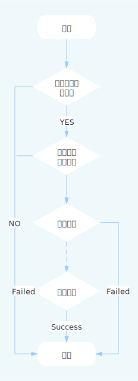

# Goctl介绍
Goctl是基于[go-zero](https://github.com/tal-tech/go-zero) 项目的一款微服务脚手架，通过Goctl开发人员可以快速生成
* Api Service
* Rpc Service
* Model
* Docker file
* Template 管理

对于常见的重复性的代码及工作可以通过Goctl去替代，开发人员只需要将重心放在业务上，而省去对不必要（毫无价值coding）的环节。
而且其使用起来非常简单，你甚至不用敲一行代码就可以快速启动一个api服务。

# 代码生成结构图

# 命令大全

> 说明： 由于图片比较大，对于加载不出来的情况可查看markdown文档，[点击这里](./goctl-mind.md) 查看goctl命令

# End

上一篇 [《准备工作》](prepare.md)

下一篇 [《服务目录》](./service-structure.md)