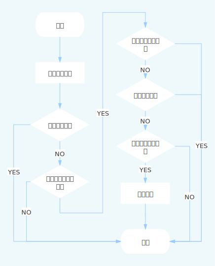

# 选课模块
经过对`user`和`course`模块的准备工作，终于到了我们的核心业务——选课模块了。
在本次选课中，由于是演示项目，我们不考虑学期问题，认为当前任意时间段均为一个学期，因此将选课
限制为仅允许发布一次选课任务，我们认为每个学生每个学期最多允许修得学分12分，我们认为个课程就为后续的一个班级，除以上需求外，
本模块将包含一下业务：
* 创建选课任务
    > 仅管理员可编辑
* 编辑选课任务
    > 编辑选课任务的前提仅选课任务尚未发布时可修改，仅管理员可编辑
* 查看选课任务
    > 任意用户均可查看
* 选课
    > 仅学生可选
* 取消选课
    > 仅学生可取消选课

* 查看我的选课
* 删除选课
    > 即该课程被删除，对已经选择的学生将无效，仅管理员可删除。
* 选课通知
    > 一个延时队列或者定时脚本输出日志模拟选课通知。

# 选课任务信息
* 选课名称
* 最多可修学分
* 选课时间
* 选课通知
    > 选课前2小时通知
* 参与选课课程
    * 任课教师

# 选课流程

# 隧道
* [选课模块目录](../../service/selection)
    * [选课模块api说明文档](../../service/selection/api/readme.md)