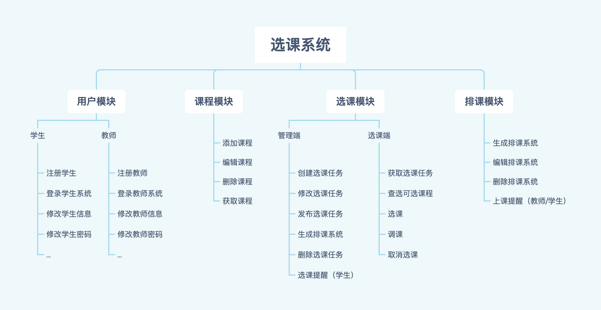

# 需求背景
随着internet的飞速发展，在线教育、电子化教育系统越来越丰富，在我们的学业
生涯中，每个学校都有那么一个很"`普通`"的选课系统，即使经常瘫痪、选不上课，
但也陪伴着我们度过来美好的4个年头。

# 目标
* 能够通过http请求完成简单的选课流程
* 完成包含但不限于如下模块的功能（陆续可能会扩充）
    * [用户模块](user.md)
    * [课程模块](course.md)
    * [选课模块](selection.md)
    * [排课模块](schedule.md)
> 注意： 各模块详细描述见模块readme

# 结构图
