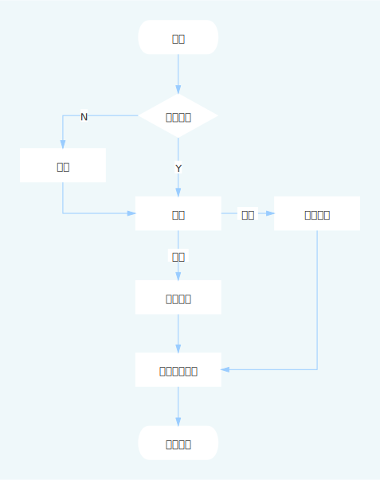

# 用户系统
用户系统可以教师(下文称：T或者Teacher)、学生(下文称：S或者Student)用户进行注册、登录、用户信息操作，除此之外，还有一种用户
超级管理员(下称：M或者Manager)，这三种用户分别能进行如下操作（仅用户系统层级）。
* 超级管理员
    * 无
* 教师
    * 注册、登录
    * 查看教师信息
    * 修改教师信息（密码）
    * 退出登录
* 学生
    * 注册、登录
    * 查看学生信息
    * 修改学生信息（密码）
    * 退出登录

# 流程图

# 源码
[点我进入用户模块](../../service/user)