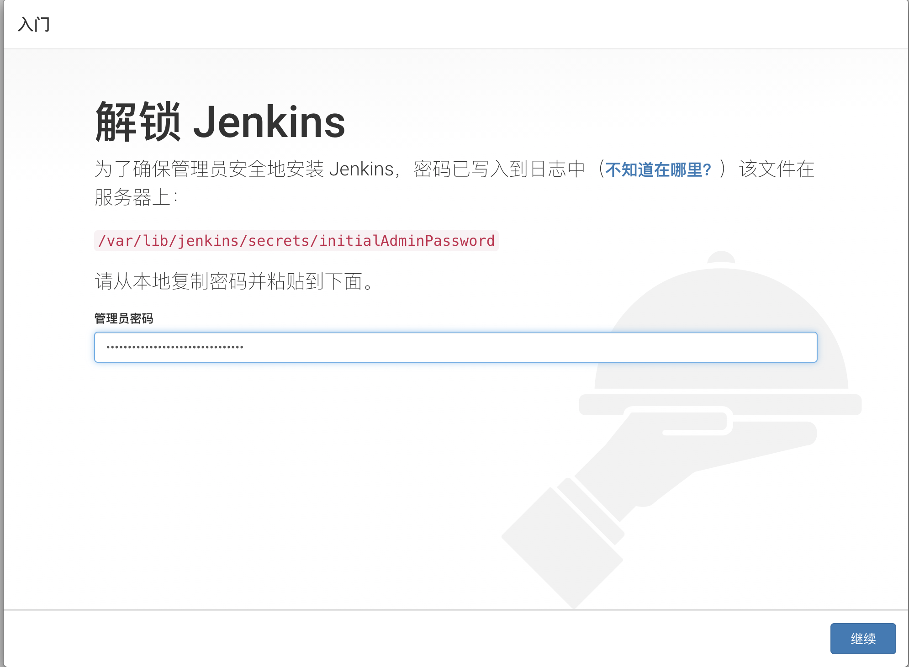
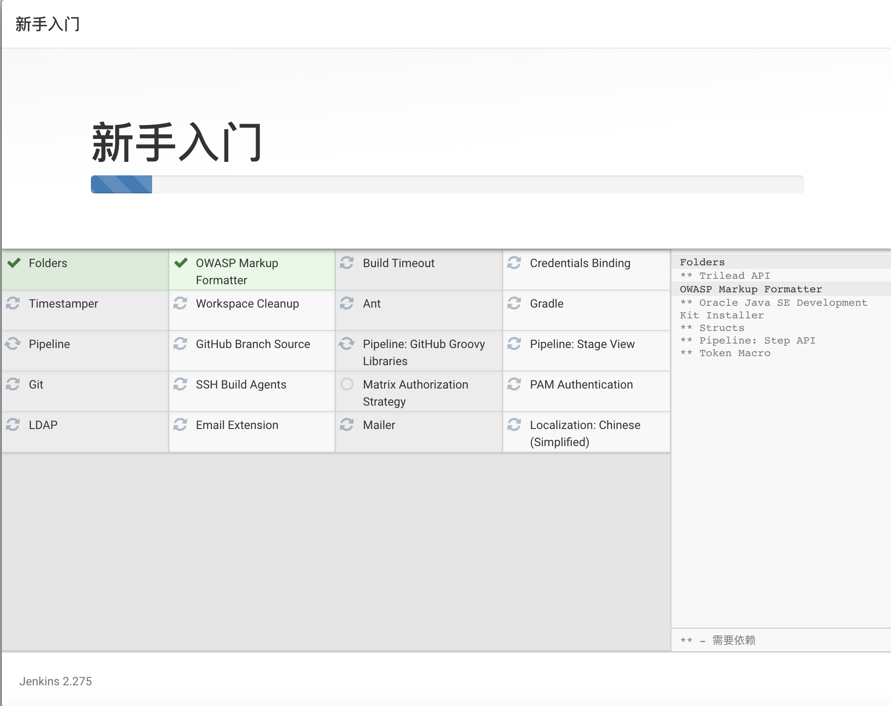
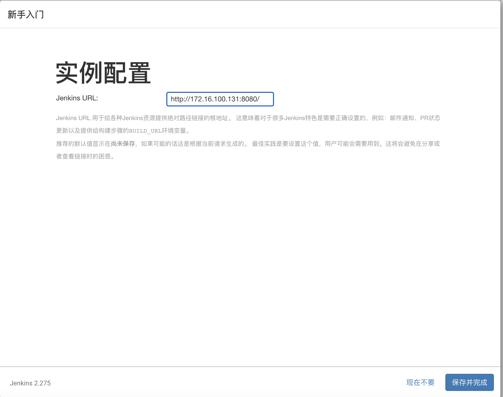
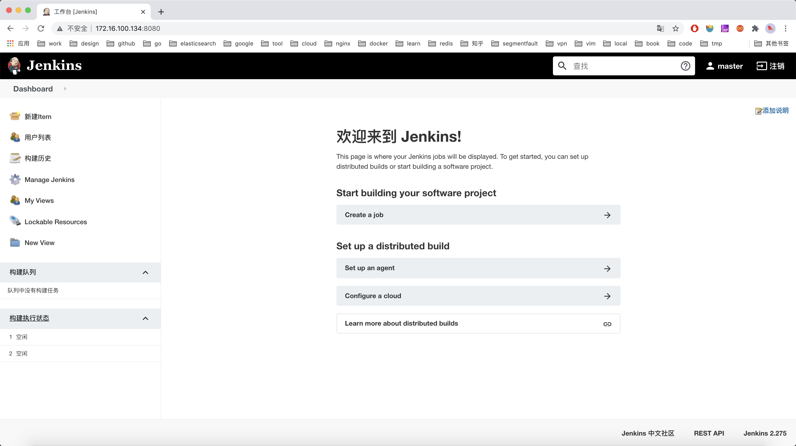

# Jekins安装

# 准备工作
* centOS 7

## 禁用防火墙
关闭防火墙
``` shell
$ systemctl stop firewalld.service
```
禁止开机启动
``` shell
$ systemctl disable firewalld.service
```


# wget安装
``` shell
$ yum -y install wget
```
``` text
已加载插件：fastestmirror
Determining fastest mirrors
 * base: ftp.sjtu.edu.cn
 * extras: mirrors.163.com
 * updates: mirrors.aliyun.com
base                                                                                             | 3.6 kB  00:00:00
extras                                                                                           | 2.9 kB  00:00:00
updates                                                                                          | 2.9 kB  00:00:00
(1/4): base/7/x86_64/group_gz                                                                    | 153 kB  00:00:00
(2/4): extras/7/x86_64/primary_db                                                                | 222 kB  00:00:00
(3/4): updates/7/x86_64/primary_db                                                               | 4.7 MB  00:00:00
(4/4): base/7/x86_64/primary_db                                                                  | 6.1 MB  00:00:02
正在解决依赖关系
--> 正在检查事务
---> 软件包 wget.x86_64.0.1.14-18.el7_6.1 将被 安装
--> 解决依赖关系完成

依赖关系解决

========================================================================================================================
 Package                  架构                       版本                                源                        大小
========================================================================================================================
正在安装:
 wget                     x86_64                     1.14-18.el7_6.1                     base                     547 k

事务概要
========================================================================================================================
安装  1 软件包

总下载量：547 k
安装大小：2.0 M
...
```

# 安装Java
``` shell
$ yum -y install java
```
``` text
已加载插件：fastestmirror
Loading mirror speeds from cached hostfile
 * base: ftp.sjtu.edu.cn
 * extras: mirrors.163.com
 * updates: mirrors.aliyun.com
正在解决依赖关系
--> 正在检查事务
---> 软件包 java-1.8.0-openjdk.x86_64.1.1.8.0.275.b01-0.el7_9 将被 安装
....
```

查看java版本
``` shell
$ java -version
```
``` text
openjdk version "1.8.0_275"
OpenJDK Runtime Environment (build 1.8.0_275-b01)
OpenJDK 64-Bit Server VM (build 25.275-b01, mixed mode)
```

# 安装jenkins
将jenkins的repo添加到yum
``` shell
$ wget -O /etc/yum.repos.d/jenkins.repo http://pkg.jenkins-ci.org/redhat/jenkins.repo
rpm --import https://jenkins-ci.org/redhat/jenkins-ci.org.key
yum install jenkins --nogpgcheck
```

> ## 温馨提示
> 其中第二个命令会比较耗时，最好直接访问`https://jenkins-ci.org/redhat/jenkins-ci.org.key`下载后上传到centOS服务器后操作。

## 配置端口
端口默认为8080，可以通过以前方法修改端口
``` shell
$ vi /etc/sysconfig/jenkins
```

# 启动jenkins
启动jenkins
``` shell
$ service jenkins start
```
``` text
Starting jenkins (via systemctl):                          [  确定  ]
```

查看初始化密码
``` shell
cat /var/lib/jenkins/secrets/initialAdminPassword 
```


安装推荐的插件




