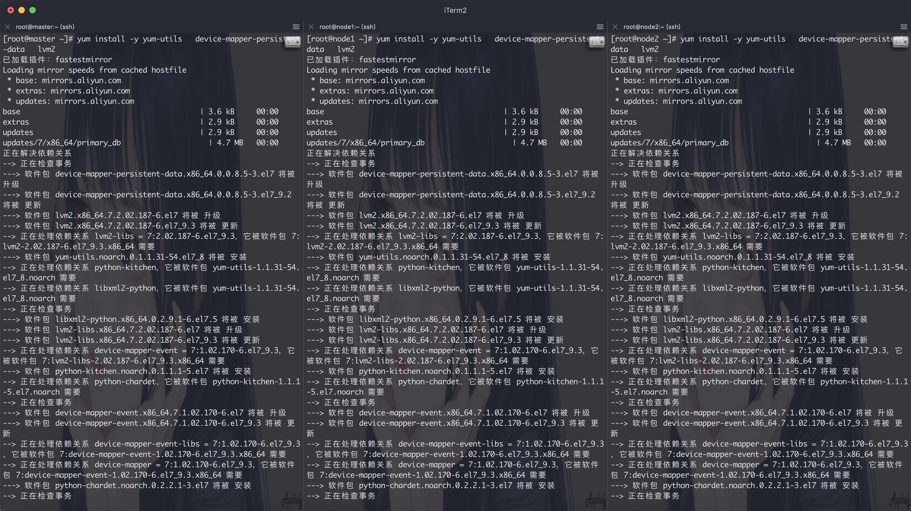
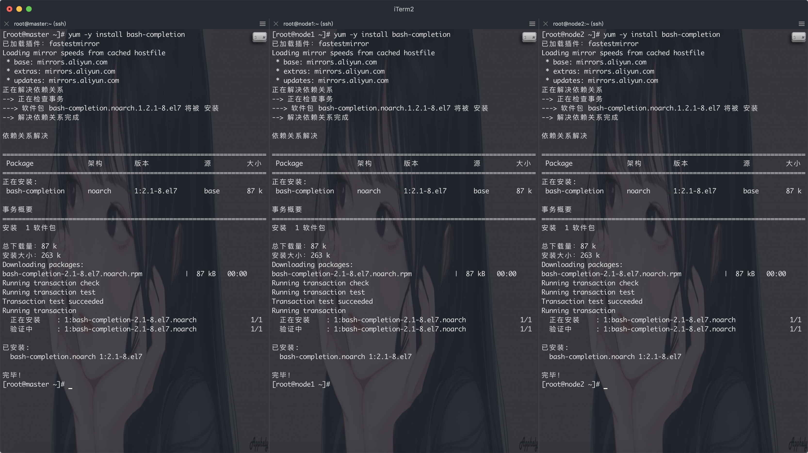
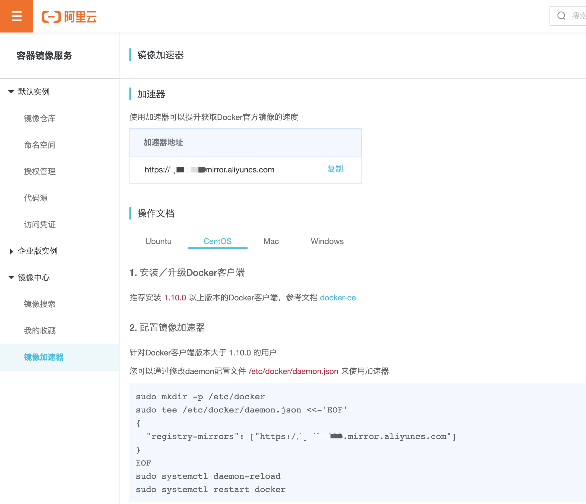
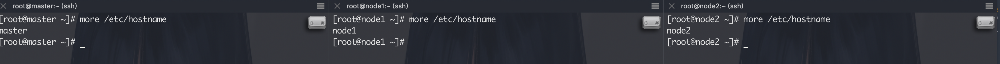
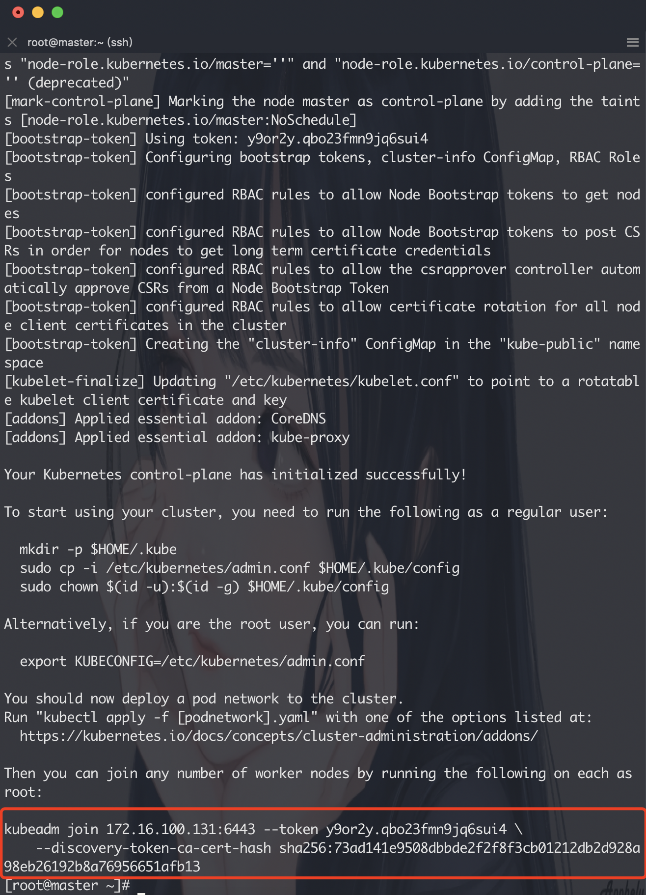
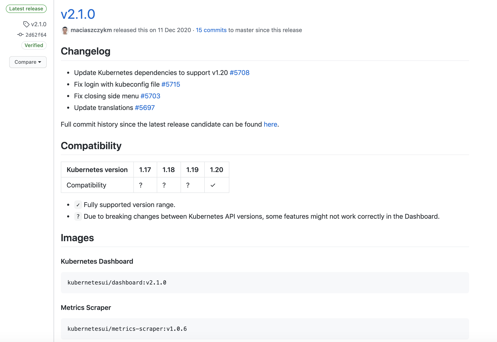
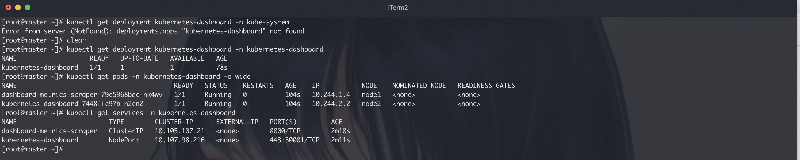
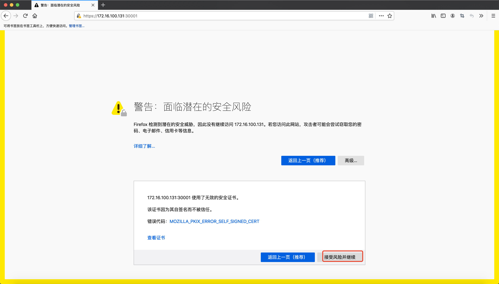
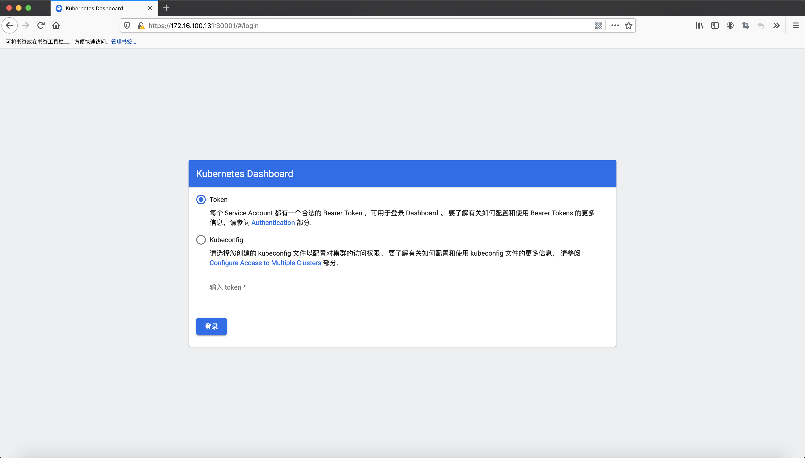
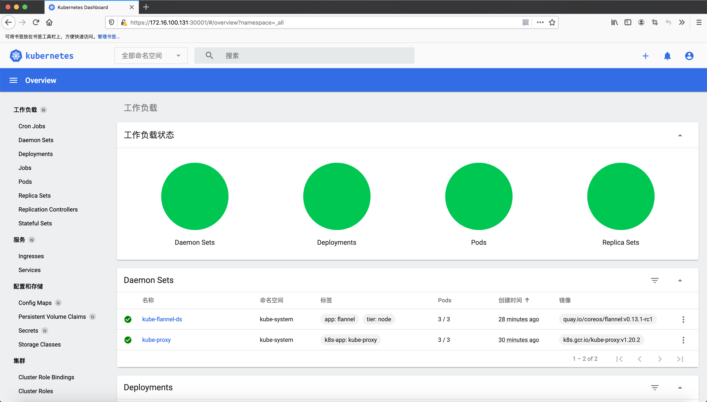

# k8s集群安装

> 作者：[松妹子](https://github.com/anqiansong)
>
> 日期：2020年01月14日

其中1～3各个节点都需要安装，第4、6、7步仅在master操作，第5步在node1、node2节点操作。
如果4、5操作失败均可用命令`kubeadm reset`重置后重新走第4、5步流程。

# 1、Docker安装
## 依赖包安装
``` shell
$ yum install -y yum-utils   device-mapper-persistent-data   lvm2
```


## 设置Docker源
``` shell
$ yum-config-manager     --add-repo     https://download.docker.com/linux/centos/docker-ce.repo
```
``` text
已加载插件：fastestmirror
adding repo from: https://download.docker.com/linux/centos/docker-ce.repo
grabbing file https://download.docker.com/linux/centos/docker-ce.repo to /etc/yum.repos.d/docker-ce.repo
repo saved to /etc/yum.repos.d/docker-ce.repo
```

## 安装Docker CE
通过如下命令可以安装最新版Docker
``` shell
$ yum install -y docker-ce docker-ce-cli containerd.io
```

你也可以下载指定版本的Docker
``` shell
$ yum install -y docker-ce-${version} docker-ce-cli-${version} containerd.io
```
> ${version}为具体版本号

## 启动Docker
``` shell
$ systemctl start docker
$ systemctl enable docker
```

## 命令不全
``` shell
$ yum -y install bash-completion
```


``` shell
$ source /etc/profile.d/bash_completion.sh
```

## 设置镜像加速
> 由于Docker Hub的服务器在国外，下载镜像会比较慢，可以配置镜像加速器。主要的加速器有：Docker官方提供的中国registry mirror、阿里云加速器、DaoCloud 加速器，本文以阿里加速器配置为例。

* 登陆地址为：https://cr.console.aliyun.com ,未注册的可以先注册阿里云账户

  
``` shell
sudo mkdir -p /etc/docker
sudo tee /etc/docker/daemon.json <<-'EOF'
{
  "registry-mirrors": [${mirrors}]
}
EOF
sudo systemctl daemon-reload
sudo systemctl restart docker
```
> ${mirrors}为你阿里云具体加速镜像地址

## 配置daemon.json文件
``` shell
$ mkdir -p /etc/docker
$ tee /etc/docker/daemon.json <<-'EOF'
{
  "registry-mirrors": ["https://v16stybc.mirror.aliyuncs.com"]
}
EOF
```
``` text
{
  "registry-mirrors": ["https://v16stybc.mirror.aliyuncs.com"]
}
```

## 重启服务
``` shell
$ systemctl daemon-reload
$ systemctl restart docker
```

## 查看Docker版本验证安装是否成功
``` shell
$ docker --version
```
``` text
Docker version 20.10.2, build 2291f61
```

2、k8s安装准备
> ## 注意
> 在centOS没有准备好之前，请参考上一篇[《centOS安装》](./centos_install.md)

## 配置主机名
先查看每个虚拟机对应的hostname是否分别为master、node1、node2
``` shell
$ more /etc/hostname
```


如果hostname不对的话，可以通过一下方式修改
``` shell
$ hostnamectl set-hostname ${hostname}
```
> ${hostname}为主机名称

## 修改hosts
``` shell
$ cat >> /etc/hosts << EOF
172.16.100.131	master
172.16.100.132	node1
172.16.100.133	node2
EOF
```

## 验证mac地址uuid
``` shell
$ cat /sys/class/net/ens33/address
$  cat /sys/class/dmi/id/product_uuid
```
> 保证各节点mac和uuid唯一

## 禁用swap
* 临时禁用
    ``` shell
    $ swapoff -a
    ```
* 永久禁用
  
  若需要重启后也生效，在禁用swap后还需修改配置文件/etc/fstab，注释swap
    ``` shell
    $ vim /etc/fstab
    ```
    

## 内核参数修改
* 临时修改
``` shell
$ sysctl net.bridge.bridge-nf-call-iptables=1
$ sysctl net.bridge.bridge-nf-call-ip6tables=1
```
* 永久修改
``` shell
$ cat <<EOF >  /etc/sysctl.d/k8s.conf
net.bridge.bridge-nf-call-ip6tables = 1
net.bridge.bridge-nf-call-iptables = 1
EOF
```

## 修改Cgroup Driver
修改daemon.json，新增‘"exec-opts": ["native.cgroupdriver=systemd"’
``` shell
$ vim /etc/docker/daemon.json 
```


> 修改cgroupdriver是为了消除告警：
[WARNING IsDockerSystemdCheck]: detected "cgroupfs" as the Docker cgroup driver. The recommended driver is "systemd". Please follow the guide at https://kubernetes.io/docs/setup/cri/

## 重新加载docker
``` shell
$ systemctl daemon-reload
$ systemctl restart docker
```

## 设置k8s源
``` shell
$ cat <<EOF > /etc/yum.repos.d/kubernetes.repo
[kubernetes]
name=Kubernetes
baseurl=https://mirrors.aliyun.com/kubernetes/yum/repos/kubernetes-el7-x86_64/
enabled=1
gpgcheck=1
repo_gpgcheck=1
gpgkey=https://mirrors.aliyun.com/kubernetes/yum/doc/yum-key.gpg https://mirrors.aliyun.com/kubernetes/yum/doc/rpm-package-key.gpg
EOF
```

> * [] 中括号中的是repository id，唯一，用来标识不同仓库
> * name 仓库名称，自定义
> * baseurl 仓库地址
> * enable 是否启用该仓库，默认为1表示启用
> * gpgcheck 是否验证从该仓库获得程序包的合法性，1为验证
> * repo_gpgcheck 是否验证元数据的合法性 元数据就是程序包列表，1为验证
> * gpgkey=URL 数字签名的公钥文件所在位置，如果gpgcheck值为1，此处就需要指定gpgkey文件的位置，如果gpgcheck值为0就不需要此项了

## 更新缓存
``` shell
$ yum clean all
$ yum -y makecache
```


# 3、节点安装

## 安装最新版本kubelet、kubeadm和kubectl
``` shell
$ yum install -y kubelet kubeadm kubectl
```

你也可以安装指定版本
``` shell
$ yum install -y kubelet-${version} kubeadm-${version} kubectl-${version}
```
> ${version}为k8s版本

## 启动kubelet并设置开机启动
``` shell
$ systemctl enable kubelet && systemctl start kubelet
```

## kubelet命令补全
``` shell
$ echo "source <(kubectl completion bash)" >> ~/.bash_profile
$ source ~/.bash_profile 
```
## 下载镜像
查看一下kubectl版本
``` shell
$ kubectl version
```
``` text
Client Version: version.Info{Major:"1", Minor:"20", GitVersion:"v1.20.2", GitCommit:"faecb196815e248d3ecfb03c680a4507229c2a56", GitTreeState:"clean", BuildDate:"2021-01-13T13:28:09Z", GoVersion:"go1.15.5", Compiler:"gc", Platform:"linux/amd64"}
The connection to the server localhost:8080 was refused - did you specify the right host or port?
```
> 由kubctl版本可得知安装的版本为1.20.2

``` shell
$ vim ~/image.sh
```
输入如下内容
``` text
#!/bin/bash
url=registry.cn-hangzhou.aliyuncs.com/google_containers
version=v1.20.2
images=(`kubeadm config images list --kubernetes-version=$version|awk -F '/' '{print $2}'`)
for imagename in ${images[@]} ; do
  docker pull $url/$imagename
  docker tag $url/$imagename k8s.gcr.io/$imagename
  docker rmi -f $url/$imagename
done
```
> 其中version值要与kubectl、kubeadm、kubelet版本一致

## 下载images
``` shell
$ cd ~
$ chmod +x image.sh
$ ./image.sh
```


## 查看images验证一下
``` shell
$ dokcer images
```
``` text
REPOSITORY                           TAG        IMAGE ID       CREATED         SIZE
k8s.gcr.io/kube-proxy                v1.20.2    43154ddb57a8   3 days ago      118MB
k8s.gcr.io/kube-apiserver            v1.20.2    a8c2fdb8bf76   3 days ago      122MB
k8s.gcr.io/kube-controller-manager   v1.20.2    a27166429d98   3 days ago      116MB
k8s.gcr.io/kube-scheduler            v1.20.2    ed2c44fbdd78   3 days ago      46.4MB
k8s.gcr.io/etcd                      3.4.13-0   0369cf4303ff   4 months ago    253MB
k8s.gcr.io/coredns                   1.7.0      bfe3a36ebd25   7 months ago    45.2MB
k8s.gcr.io/pause                     3.2        80d28bedfe5d   11 months ago   683kB
```

# 4、master节点安装
## 初始化
``` shell
$ kubeadm init --apiserver-advertise-address 172.16.100.131 --pod-network-cidr=10.244.0.0/16
```

> 记录kubeadm join的输出，后面需要这个命令将各个节点加入集群中。

## 加载环境变量
``` shell
$ echo "export KUBECONFIG=/etc/kubernetes/admin.conf" >> ~/.bash_profile
$ source ~/.bash_profile 
```
本文所有操作都在root用户下执行，若为非root用户，则执行如下操作：
``` shell
$ mkdir -p $HOME/.kube
cp -i /etc/kubernetes/admin.conf $HOME/.kube/config
chown $(id -u):$(id -g) $HOME/.kube/config
```

## 安装pod网络
``` shell
$ kubectl apply -f https://raw.githubusercontent.com/coreos/flannel/master/Documentation/kube-flannel.yml
```
``` text
podsecuritypolicy.policy/psp.flannel.unprivileged created
clusterrole.rbac.authorization.k8s.io/flannel created
clusterrolebinding.rbac.authorization.k8s.io/flannel created
serviceaccount/flannel created
configmap/kube-flannel-cfg created
daemonset.apps/kube-flannel-ds created
```

## master节点配置
* 删除默认污点：
``` shell
$ kubectl taint nodes master node-role.kubernetes.io/master-
```
``` text
node/master untainted
```

# 5、Node节点安装
## 加入集群
``` shell
$ kubeadm join 172.16.100.131:6443 --token y9or2y.qbo23fmn9jq6sui4 \
    --discovery-token-ca-cert-hash sha256:73ad141e9508dbbde2f2f8f3cb01212db2d928a98eb26192b8a76956651afb13
```
``` text
[preflight] Running pre-flight checks
	[WARNING SystemVerification]: this Docker version is not on the list of validated versions: 20.10.2. Latest validated version: 19.03
[preflight] Reading configuration from the cluster...
[preflight] FYI: You can look at this config file with 'kubectl -n kube-system get cm kubeadm-config -o yaml'
[kubelet-start] Writing kubelet configuration to file "/var/lib/kubelet/config.yaml"
[kubelet-start] Writing kubelet environment file with flags to file "/var/lib/kubelet/kubeadm-flags.env"
[kubelet-start] Starting the kubelet
[kubelet-start] Waiting for the kubelet to perform the TLS Bootstrap...

This node has joined the cluster:
* Certificate signing request was sent to apiserver and a response was received.
* The Kubelet was informed of the new secure connection details.

Run 'kubectl get nodes' on the control-plane to see this node join the cluster.
```
> 如果以上token过期，在`master`节点上请用如下方式重新获取

## 生成新的令牌
``` shell
$ kubeadm token create
```

## 生成新的加密串
``` shell
$ openssl x509 -pubkey -in /etc/kubernetes/pki/ca.crt | openssl rsa -pubin -outform der 2>/dev/null | \
   openssl dgst -sha256 -hex | sed 's/^.* //'
```

# 6、验证集群
``` shell
$ kubectl get nodes
```
``` text
NAME     STATUS     ROLES                  AGE     VERSION
master   Ready   control-plane,master   7m52s   v1.20.2
node1    Ready   <none>                 3m      v1.20.2
node2    Ready   <none>                 2m57s   v1.20.2
```

# 7、安装Dashboard

## 查看kubernetes支持的dashboard版本
在 [kubernetes/dashboard](https://github.com/kubernetes/dashboard/releases) 找到k8s版本对应的dashboard，否则会有兼容问题。
我这里安装的版本为1.20.2,所以`V2.1.0`版本是兼容的


## 安装

* 设置外部访问端口

浏览https://raw.githubusercontent.com/kubernetes/dashboard/v2.1.0/aio/deploy/recommended.yaml中的内容，复制并新建一个名称为
`kubernetes-dashboard.yaml`的文件中，找到Service暴露外部访问端口添加`nodePort: 30001`和`type: NodePort`，添加后如下：
```
kind: Service
apiVersion: v1
metadata:
  labels:
    k8s-app: kubernetes-dashboard
  name: kubernetes-dashboard
  namespace: kubernetes-dashboard
spec:
  ports:
    - port: 443
      targetPort: 8443
      nodePort: 30001
  type: NodePort
  selector:
    k8s-app: kubernetes-dashboard
```

* 添加授权用户

``` yaml
---
apiVersion: v1
kind: ServiceAccount
metadata:
  name: dashboard-admin
  namespace: kube-system

---
apiVersion: rbac.authorization.k8s.io/v1beta1
kind: ClusterRoleBinding
metadata:
  name: dashboard-admin
subjects:
- kind: ServiceAccount
  name: dashboard-admin
  namespace: kube-system
roleRef:
  apiGroup: rbac.authorization.k8s.io
  kind: ClusterRole
  name: cluster-admin
```

完整内容：

``` yaml
# Copyright 2017 The Kubernetes Authors.
#
# Licensed under the Apache License, Version 2.0 (the "License");
# you may not use this file except in compliance with the License.
# You may obtain a copy of the License at
#
#     http://www.apache.org/licenses/LICENSE-2.0
#
# Unless required by applicable law or agreed to in writing, software
# distributed under the License is distributed on an "AS IS" BASIS,
# WITHOUT WARRANTIES OR CONDITIONS OF ANY KIND, either express or implied.
# See the License for the specific language governing permissions and
# limitations under the License.

apiVersion: v1
kind: Namespace
metadata:
  name: kubernetes-dashboard

---

apiVersion: v1
kind: ServiceAccount
metadata:
  labels:
    k8s-app: kubernetes-dashboard
  name: kubernetes-dashboard
  namespace: kubernetes-dashboard

---

kind: Service
apiVersion: v1
metadata:
  labels:
    k8s-app: kubernetes-dashboard
  name: kubernetes-dashboard
  namespace: kubernetes-dashboard
spec:
  ports:
    - port: 443
      targetPort: 8443
      nodePort: 30001
  type: NodePort
  selector:
    k8s-app: kubernetes-dashboard

---

apiVersion: v1
kind: Secret
metadata:
  labels:
    k8s-app: kubernetes-dashboard
  name: kubernetes-dashboard-certs
  namespace: kubernetes-dashboard
type: Opaque

---

apiVersion: v1
kind: Secret
metadata:
  labels:
    k8s-app: kubernetes-dashboard
  name: kubernetes-dashboard-csrf
  namespace: kubernetes-dashboard
type: Opaque
data:
  csrf: ""

---

apiVersion: v1
kind: Secret
metadata:
  labels:
    k8s-app: kubernetes-dashboard
  name: kubernetes-dashboard-key-holder
  namespace: kubernetes-dashboard
type: Opaque

---

kind: ConfigMap
apiVersion: v1
metadata:
  labels:
    k8s-app: kubernetes-dashboard
  name: kubernetes-dashboard-settings
  namespace: kubernetes-dashboard

---

kind: Role
apiVersion: rbac.authorization.k8s.io/v1
metadata:
  labels:
    k8s-app: kubernetes-dashboard
  name: kubernetes-dashboard
  namespace: kubernetes-dashboard
rules:
  # Allow Dashboard to get, update and delete Dashboard exclusive secrets.
  - apiGroups: [""]
    resources: ["secrets"]
    resourceNames: ["kubernetes-dashboard-key-holder", "kubernetes-dashboard-certs", "kubernetes-dashboard-csrf"]
    verbs: ["get", "update", "delete"]
    # Allow Dashboard to get and update 'kubernetes-dashboard-settings' config map.
  - apiGroups: [""]
    resources: ["configmaps"]
    resourceNames: ["kubernetes-dashboard-settings"]
    verbs: ["get", "update"]
    # Allow Dashboard to get metrics.
  - apiGroups: [""]
    resources: ["services"]
    resourceNames: ["heapster", "dashboard-metrics-scraper"]
    verbs: ["proxy"]
  - apiGroups: [""]
    resources: ["services/proxy"]
    resourceNames: ["heapster", "http:heapster:", "https:heapster:", "dashboard-metrics-scraper", "http:dashboard-metrics-scraper"]
    verbs: ["get"]

---

kind: ClusterRole
apiVersion: rbac.authorization.k8s.io/v1
metadata:
  labels:
    k8s-app: kubernetes-dashboard
  name: kubernetes-dashboard
rules:
  # Allow Metrics Scraper to get metrics from the Metrics server
  - apiGroups: ["metrics.k8s.io"]
    resources: ["pods", "nodes"]
    verbs: ["get", "list", "watch"]

---

apiVersion: rbac.authorization.k8s.io/v1
kind: RoleBinding
metadata:
  labels:
    k8s-app: kubernetes-dashboard
  name: kubernetes-dashboard
  namespace: kubernetes-dashboard
roleRef:
  apiGroup: rbac.authorization.k8s.io
  kind: Role
  name: kubernetes-dashboard
subjects:
  - kind: ServiceAccount
    name: kubernetes-dashboard
    namespace: kubernetes-dashboard

---

apiVersion: rbac.authorization.k8s.io/v1
kind: ClusterRoleBinding
metadata:
  name: kubernetes-dashboard
roleRef:
  apiGroup: rbac.authorization.k8s.io
  kind: ClusterRole
  name: kubernetes-dashboard
subjects:
  - kind: ServiceAccount
    name: kubernetes-dashboard
    namespace: kubernetes-dashboard

---

kind: Deployment
apiVersion: apps/v1
metadata:
  labels:
    k8s-app: kubernetes-dashboard
  name: kubernetes-dashboard
  namespace: kubernetes-dashboard
spec:
  replicas: 1
  revisionHistoryLimit: 10
  selector:
    matchLabels:
      k8s-app: kubernetes-dashboard
  template:
    metadata:
      labels:
        k8s-app: kubernetes-dashboard
    spec:
      containers:
        - name: kubernetes-dashboard
          image: kubernetesui/dashboard:v2.1.0
          imagePullPolicy: Always
          ports:
            - containerPort: 8443
              protocol: TCP
          args:
            - --auto-generate-certificates
            - --namespace=kubernetes-dashboard
            # Uncomment the following line to manually specify Kubernetes API server Host
            # If not specified, Dashboard will attempt to auto discover the API server and connect
            # to it. Uncomment only if the default does not work.
            # - --apiserver-host=http://my-address:port
          volumeMounts:
            - name: kubernetes-dashboard-certs
              mountPath: /certs
              # Create on-disk volume to store exec logs
            - mountPath: /tmp
              name: tmp-volume
          livenessProbe:
            httpGet:
              scheme: HTTPS
              path: /
              port: 8443
            initialDelaySeconds: 30
            timeoutSeconds: 30
          securityContext:
            allowPrivilegeEscalation: false
            readOnlyRootFilesystem: true
            runAsUser: 1001
            runAsGroup: 2001
      volumes:
        - name: kubernetes-dashboard-certs
          secret:
            secretName: kubernetes-dashboard-certs
        - name: tmp-volume
          emptyDir: {}
      serviceAccountName: kubernetes-dashboard
      nodeSelector:
        "kubernetes.io/os": linux
      # Comment the following tolerations if Dashboard must not be deployed on master
      tolerations:
        - key: node-role.kubernetes.io/master
          effect: NoSchedule

---

kind: Service
apiVersion: v1
metadata:
  labels:
    k8s-app: dashboard-metrics-scraper
  name: dashboard-metrics-scraper
  namespace: kubernetes-dashboard
spec:
  ports:
    - port: 8000
      targetPort: 8000
  selector:
    k8s-app: dashboard-metrics-scraper

---

kind: Deployment
apiVersion: apps/v1
metadata:
  labels:
    k8s-app: dashboard-metrics-scraper
  name: dashboard-metrics-scraper
  namespace: kubernetes-dashboard
spec:
  replicas: 1
  revisionHistoryLimit: 10
  selector:
    matchLabels:
      k8s-app: dashboard-metrics-scraper
  template:
    metadata:
      labels:
        k8s-app: dashboard-metrics-scraper
      annotations:
        seccomp.security.alpha.kubernetes.io/pod: 'runtime/default'
    spec:
      containers:
        - name: dashboard-metrics-scraper
          image: kubernetesui/metrics-scraper:v1.0.6
          ports:
            - containerPort: 8000
              protocol: TCP
          livenessProbe:
            httpGet:
              scheme: HTTP
              path: /
              port: 8000
            initialDelaySeconds: 30
            timeoutSeconds: 30
          volumeMounts:
          - mountPath: /tmp
            name: tmp-volume
          securityContext:
            allowPrivilegeEscalation: false
            readOnlyRootFilesystem: true
            runAsUser: 1001
            runAsGroup: 2001
      serviceAccountName: kubernetes-dashboard
      nodeSelector:
        "kubernetes.io/os": linux
      # Comment the following tolerations if Dashboard must not be deployed on master
      tolerations:
        - key: node-role.kubernetes.io/master
          effect: NoSchedule
      volumes:
        - name: tmp-volume
          emptyDir: {}

---
apiVersion: v1
kind: ServiceAccount
metadata:
  name: dashboard-admin
  namespace: kube-system

---
apiVersion: rbac.authorization.k8s.io/v1beta1
kind: ClusterRoleBinding
metadata:
  name: dashboard-admin
subjects:
- kind: ServiceAccount
  name: dashboard-admin
  namespace: kube-system
roleRef:
  apiGroup: rbac.authorization.k8s.io
  kind: ClusterRole
  name: cluster-admin
```

## 部署
``` yaml
$ kubectl apply -f kubernetes-dashboard.yaml
```
``` text
namespace/kubernetes-dashboard created
serviceaccount/kubernetes-dashboard created
service/kubernetes-dashboard created
secret/kubernetes-dashboard-certs created
secret/kubernetes-dashboard-csrf created
secret/kubernetes-dashboard-key-holder created
configmap/kubernetes-dashboard-settings created
role.rbac.authorization.k8s.io/kubernetes-dashboard created
clusterrole.rbac.authorization.k8s.io/kubernetes-dashboard created
rolebinding.rbac.authorization.k8s.io/kubernetes-dashboard created
clusterrolebinding.rbac.authorization.k8s.io/kubernetes-dashboard created
deployment.apps/kubernetes-dashboard created
service/dashboard-metrics-scraper created
deployment.apps/dashboard-metrics-scraper created
serviceaccount/dashboard-admin created
Warning: rbac.authorization.k8s.io/v1beta1 ClusterRoleBinding is deprecated in v1.17+, unavailable in v1.22+; use rbac.authorization.k8s.io/v1 ClusterRoleBinding
clusterrolebinding.rbac.authorization.k8s.io/dashboard-admin created
```

## 状态查看
``` shell
$ kubectl get deployment kubernetes-dashboard -n kubernetes-dashboard
$ kubectl get pods -n kubernetes-dashboard -o wide
```


## 令牌查看
``` shell
$ kubectl describe secrets -n kube-system dashboard-admin
```

## 访问dashboard
用火狐浏览器访问https://172.16.100.131:30001/

> google浏览器需要重新设置证书，这里不赘述，自行google。





# 8、结尾
至此，k8s简单集群安装完毕！

# 参考链接
以上大部分内容参考自[k8s实践(一)：Centos7.6部署k8s(v1.14.2)集群](https://blog.51cto.com/3241766/2405624#h1)